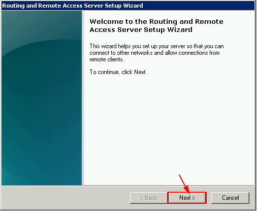
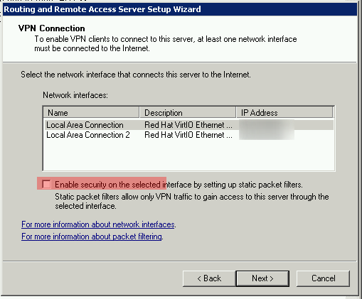
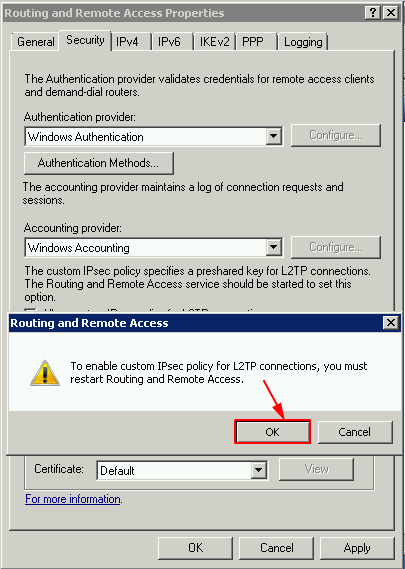

# Cài đặt VPN L2TP trên Windows2k8

## Chuẩn bị môi trường

Yêu cầu: 

- Chuẩn bị OS: Windows Server 2k8 32 bit hoặc 64 bit

- Máy phải có 2 card mạng

Mô hình cài đặt kết nối

## Cài đặt Routing và Remote Access Services

Click `Start` --> `Administrative Tools` --> `Server Manager`

Trong `Server Manager` --> `Roles` --> `Roles Summary` --> `Add Roles`

Trong màn `Before You Begin` chọn `Next`

Trong màn `Select Server Roles` chọn `Network Policy and Access Services` và chọn `Next`

Chọn `Next` tại màn `Network Policy and Access Services`

Đối với màn `Select Role Services` chúng ta chọn `Routing and Remote Access Services` và chọn `Next`

Confirm quá trình cài đặt và chọn `Next`

Quá trình cài đặt diễn ra 

Hoàn tất cài đặt 

## Enable Routing and Remote Access Service

Truy cập màn `Server Manager` mở `Network Policy and Access Services` -->  Chuột phải `Routing and Remote Access` --> Chọn `Configure and Enable Routing and Remote Access`

Bắt đầu cấu hình chọn `Next`

Chọn `Remote access (dial-up or VPN)` và chọn `Next`

Ở màn `Remote Access` chọn `VPN` và chọn `Next`

Nếu chỉ có một card mạng sẽ có thông báo như sau

Tiến hành cấu hình thêm card mạng thứ 2 và cấu hình lại 

Ở mục `VPN Connection` chọn card có kết nối Internet + Bỏ tick `Enable security ..` --> Chọn `Next`

Cấu hình Range DHCP bằng tay 

Chọn `New...` để tạo mới dải DHCP

Nhập thông tin Pool DHCP cần cấp

Chọn `Next`

Chọn sử dụng `Routing and Remote Access` để xác thực 

Hoàn tất cài đặt 

Chờ thông tin cấu hình hoàn tất 

## Remote Authentication and Forwarding options

Bây giờ chúng ta cần đặt một khóa chia sẻ trước (PSK)để tránh các tấn công kiểu ‘Man in Middle Middle (MitM).Nếu bạn muốn sử dụng xác thực chứng chỉ, bạn phải mua chứng chỉ SSL hoặc sử dụng vai trò Dịch vụ chứng chỉ Active Directory để tạo chứng chỉ của riêng bạn.

Chuột phải vào `Routing and Remote Access`

Trong tab `General` chọn `IPv4 router` và `IPv4 Remote Access Server`

Tại tab `IPv4` check `Enable IPv4 Forwarding`

Tại tab `Security` check `Allow custom IPsec policy for L2TP connection` và nhập 1 chuỗi preshared key bất kỳ

Confirm quá trình setup 

Để apply các setting cần restart server 

## Cấu hình Remote Access Network Policy

Mở `Server Manager` --> `Configuration` --> `Local Users and Groups` --> `Users` 

Lựa chọn User chúng ta muốn gán quyền và thực hiện click chuột phải chọn `Properties`

Tại tab `Dial-in` chọn `Allow access` --> `Apply`

## Cấu hình NAT 

Trong `Server Manager` tab `Roles` --> `Network Policy and Access Services` --> `Routing And Remote Access`

Trong tab IPv4 chuột phải vào `General` --> chọn `New Routing Protocol`

Lựa chọn `NAT` và `OK` quá trình cài đặt hoàn tất 

## Kết nối Client Windows

Win10 chọn `Open Network & Internet settings`

Chọn `VPN`

Chọn `Add a VPN connection`

Bổ sung thêm thông tin kết nối

Chọn `Connect`

Chờ thông tin kết nối 

Kết nối thành công 

Kiểm tra kết nối 

## Kết nối Client Linux 

# Tài liệu tham khảo 

https://site.elastichosts.com/blog/windows-l2tpipsec-vpn-server/

https://site.elastichosts.com/blog/windows-l2tpipsec-vpn-client/

